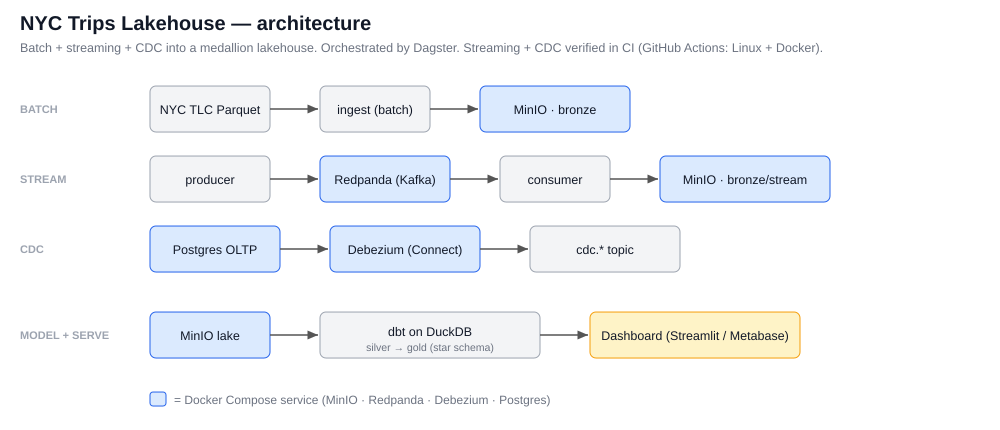

# NYC Trips Lakehouse

[](https://github.com/mohamed-abo-taha/nyc-lakehouse/actions/workflows/ci.yml)

An end-to-end data platform on real, messy data: it ingests NYC TLC trip records
two ways (batch + streaming), lands them in an object-store data lake,
models them into a tested star schema with dbt, runs data-quality checks, and
serves analytics — orchestrated, containerized, and CI-validated.

The whole stack runs locally and free via Docker Compose, but every piece maps
1:1 to a cloud equivalent (see the table below), so the skills transfer directly.

## Architecture (medallion: bronze -> silver -> gold)



```
NYC TLC Parquet ──ingest──► MinIO (S3)            DuckDB + dbt                Postgres / DuckDB
 (batch + streaming)        bronze (raw) ─────►  silver (clean, typed) ─────► gold (star schema) ──► Metabase / Streamlit
                                                  + dbt tests + DQ audit
                              orchestrated by Dagster · validated in CI · provisioned by Docker Compose
```

## Stack, with the tools/acronyms you see in JDs

| Layer | JD keywords | What runs here (free, local) | Cloud equivalent |
|---|---|---|---|
| Lake / object store | **S3**, data lake | **MinIO** | AWS S3, GCS, ADLS |
| Lakehouse engine | **OLAP**, MPP, ACID | **DuckDB** (httpfs over MinIO) | Snowflake, BigQuery (**BQ**), Redshift |
| Transform / model | **dbt**, **ELT**, Kimball, star schema, **SCD2** | dbt-duckdb | dbt on Snowflake/BQ |
| Orchestration | **DAG**, Airflow | **Dagster** (asset graph + schedule) | Airflow/MWAA, Composer, **ADF** |
| Ingestion / stream | batch, **CDC**, **Kafka** | Python + **Redpanda** + **Debezium** | Kinesis, Pub/Sub, Dataflow |
| Warehouse / serving | **DWH**, **OLTP** | Postgres | Redshift, Synapse |
| Data quality | **DQ**, GE, Soda, tests | dbt tests + a DQ audit | Great Expectations, Soda |
| BI | dashboards, semantic layer | Metabase or Streamlit | Looker, Power BI |
| Infra / deploy | **IaC**, Docker, **K8s**, **CI/CD** | Docker Compose + GitHub Actions | Terraform, EKS/GKE |
| Formats | **Parquet**, Avro | Parquet | Parquet/ORC/Avro |

## Data

NYC Taxi & Limousine Commission yellow-taxi trips (public, ~3M rows/month,
genuinely messy: schema drift across years, bad timestamps, negatives, nulls).
Configurable months in `.env` (default 2023-01..03). The same design skins onto
telecom **CDR**s (Call Detail Records): event records → bronze → conformed star
schema → analytics.

## Data model (gold star schema)

```
            dim_date
               │
dim_vendor ─┐  │  ┌─ dim_zone (pickup / dropoff)
            ├ fct_trips ┤
dim_rate ───┘  │  └─ dim_payment_type
               (grain: one trip; measures: distance, duration, fare, tip, total)
```

Foreign keys are coalesced to each dimension's "unknown" member in silver, so the
fact is referentially complete and `relationships` tests pass. The fact is
**incremental** (only new pickups are processed on re-run) and deduplicated on a
surrogate key, because TLC trips have no natural primary key.

## Run it

```bash
python -m venv .venv && .venv/Scripts/activate     # or source .venv/bin/activate
pip install -r requirements.txt
cp .env.example .env

docker compose up -d                # MinIO (:9000/:9001) + Postgres (:5432)
python scripts/run_pipeline.py      # seeds -> ingest -> dbt build+test -> DQ audit

dagster dev -f orchestration/definitions.py   # orchestration UI (:3000)
streamlit run dashboard/app.py                # dashboard on the gold marts
docker compose --profile bi up -d             # Metabase BI (:3000), connect to Postgres

# streaming + CDC (needs Docker):
docker compose --profile stream up -d         # + Redpanda (Kafka) + Debezium (Connect)
python scripts/smoke_stream_cdc.py            # produce/consume + capture CDC, end to end
```

Endpoints: MinIO console `localhost:9001` (minioadmin/minioadmin), Postgres
`localhost:5432`, Dagster/Streamlit/Metabase as above.

## Data quality

Two layers. dbt tests enforce schema contracts: `not_null`, `unique`,
`relationships` (every fact FK exists in its dimension), and `accepted_range` on
measures. A separate audit (`pipeline/quality.py`) enforces operational rules the
pipeline fails on: non-empty fact, no duplicate keys, no orphaned zones, no
negative totals, and a freshness read. Great Expectations / Soda would drop into
the same slot.

## Layout

```
docker-compose.yml      MinIO + Postgres (+ Metabase/Redpanda behind profiles)
pipeline/               config, ingest (-> bronze), storage (MinIO + DuckDB), DQ audit
dbt/                    sources, staging (silver), marts (gold star schema), seeds, tests
orchestration/          Dagster asset graph (ingest -> dbt -> DQ) + daily schedule
dashboard/              Streamlit on the gold marts
streaming/              Kafka producer + consumer (-> bronze/stream)
cdc/                    Postgres source, Debezium connector, change-capture demo
scripts/                fetch_seeds, run_pipeline, smoke_stream_cdc
tests/                  offline unit tests (settings + cleaning rules)
.github/workflows/      CI: validate (dbt parse + pytest) + integration (full Docker stack)
```

## What it demonstrates

Building a medallion lakehouse on object storage; leakage-free ELT modeling with
dbt (staging → conformed star schema, incremental fact, dedup, SCD-ready dims);
data-quality contracts; orchestration as an asset DAG with a schedule;
containerized infra; and CI. It is the platform side that complements an ML repo:
this is what produces clean, tested, queryable datasets for downstream models.

## Streaming + CDC (built, verified in CI)

Both run under the `stream` Compose profile and are exercised end-to-end by the CI
`integration` job on a Linux + Docker runner. (The dev box's Docker Desktop was
broken, so the cloud CI run is the proof.)

- **Streaming**: a producer replays trips into **Redpanda** (Kafka API); a consumer
  lands micro-batches into `bronze/stream`. Last run: 5,000 produced → 5,000
  consumed.
- **CDC**: **Debezium** captures inserts/updates/deletes on a Postgres `drivers`
  table (with before/after images) to `cdc.public.drivers`. Last run: connector
  registered (HTTP 201), 6 change events captured (snapshot + update + insert + delete).

Run locally once Docker is available: `docker compose --profile stream up -d`,
then `python scripts/smoke_stream_cdc.py` (or `make produce / consume / cdc`).

## Phase 2 (next)

**SCD2** dimensions via dbt snapshots on the CDC source; Iceberg/Delta table format
for ACID/time-travel on the lake; Terraform (+ LocalStack) for infra as code.
